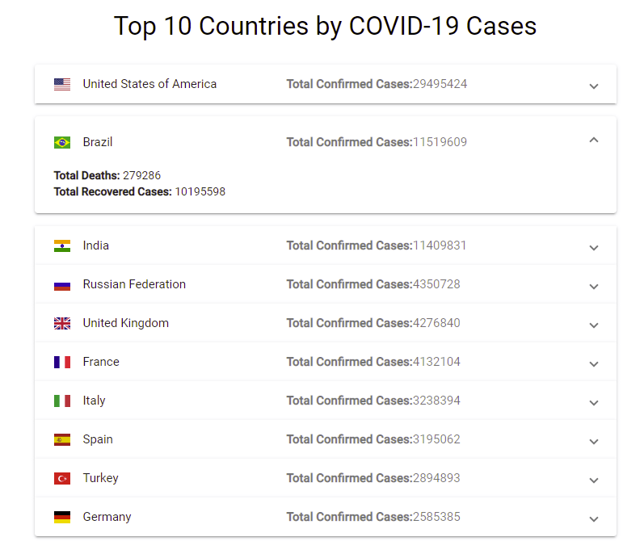

# Covid Country Tracker
###### by Eli Karpinsky

Developed and tested with Node.js 10.22 and Angular 11.2.5.
This application requires Node.js and Angular CLI to work.

An expandable list of the top 10 countries is displayed on the screen. Click on any of the countries to see more information.

## Development server

Run `ng serve` for a dev server. Navigate to `http://localhost:4200/`. The app will automatically reload if you change any of the source files.

## Build

Run `ng build` to build the project. The build artifacts will be stored in the `dist/` directory. Use the `--prod` flag
for a production build.

